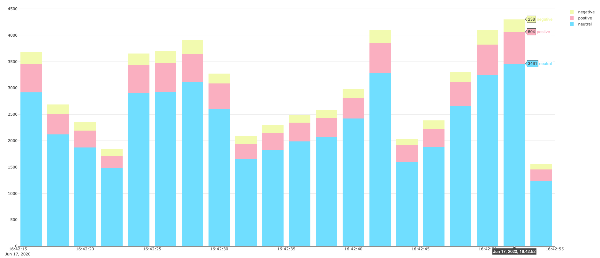
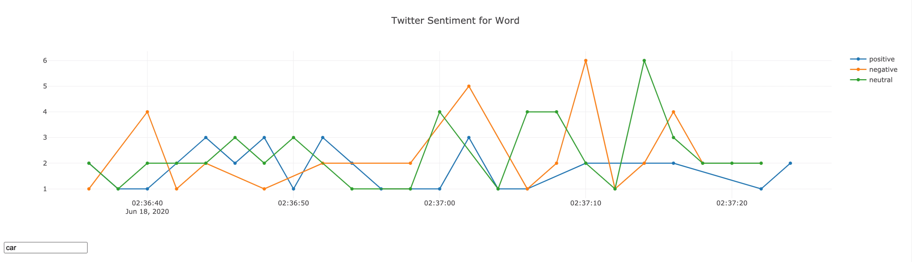
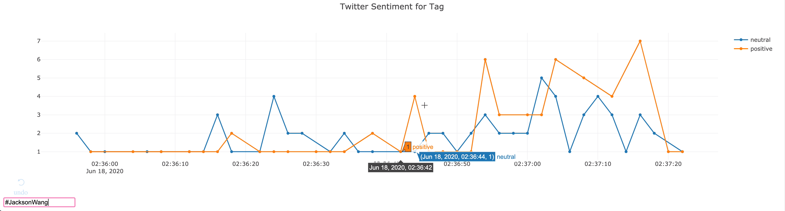
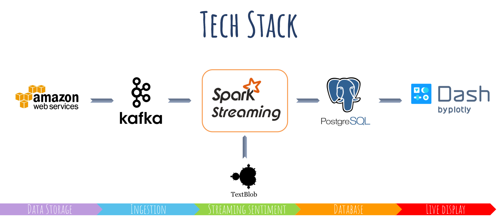
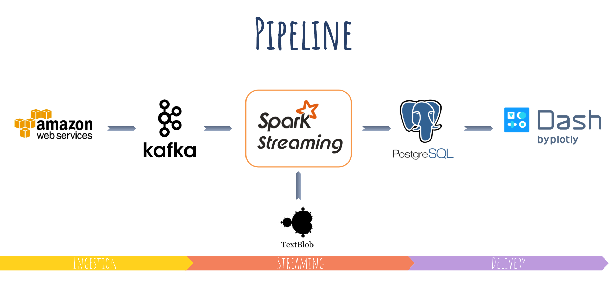

# Streaming Sentiment
#### Shan Lu - Insight Data Engineering (Silicon Valley 2020)
## Introduction
The goal of this project is to build a real-time sentiment analysis platform for any real time JSON format data source. In this project, Twitter dataset is used to simulate the real-time sentiment analysis process. 

[Slides](https://docs.google.com/presentation/d/1dSipEcaB8JNQSRuDBkvF47GOYJk0uZnkLFCpJqRxarA/edit) and [Demo](https://youtu.be/MRCoRtzdXlM)

## Problem Statement
For business, if someone was talking about you or your brand, you need to know what the consumers are saying about your business and your competitors. For advertisers, if you are going to post an advertisement at a specific time or location, you may also want to know the potentional audience's feelings. The applications of sentiment analysis in business cannot be overlooked. 

## Solution Statement
So, what is the solution? How do we build a real time platform that can provide sentiment analysis for different topics and different tags at real time? Also, you can figure out people's sentiment at that moment. There are hundereds of social media applications. For example, there are more than 1.3 million users on twitter, and there are more than 6000 tweets appearing per second. Then we will use these data as a source to the platform and deliver continuous information on a dynamic web page for business and advertisement decision making. 

## Technology Stack
In the pipeline, we are using aws s3 to store data, kafka to ingest data, spark for streaming, PostgreSQL as the database and dash for live displaying. Also, in spark streaming process, we use TextBlob, a NLP package to get sentiment index. 

## Dataset
To simulate the real time platforam, we are using Twitter [Dataset](https://archive.org/search.php?query=collection%3Atwitterstream&sort=-publicdate) in this project. 

## Instructions
To start the platform, please follow the [instructions](https://github.com/sl3329/Social_Media_Sentiment_Analyzer/tree/master/Instructions) to set up EC2 instances and install [AWS CLI](https://aws.amazon.com/cn/cli/). 

Then set up clusters following links in [instructions](https://github.com/sl3329/Social_Media_Sentiment_Analyzer/tree/master/Instructions):

(4 nodes) Spark-Cluster, instance type: m4.large

(3 nodes) Kafka-Cluster , instance type: m4.large

(1 node) PostgreSQL(Timescale) , instance type: m4.large

(1 node) Dash , instance type: m4.large

## Engineering Challenges
The overall pipeline has been divided into 3 steps: ingestion, streaming, and delivery. 

#### Ingestion
For [step 1](https://github.com/sl3329/Social_Media_Sentiment_Analyzer/tree/master/S3_2_Kafka), we load data from aws s3, and use kafka producer to keep publishing these data into one kafka topic. We have 3 kafka brokers with 3 zookeepers, and one more node for control center. It can produce around 3000 records per second. After adding one more python script to run kafka producer to publish data into the same topic, it can produce around 6000 records per second. With more scripts running at the same time, we should adjust the linger time to wait for more records to arrive and get added to the same batch. In addition, this data source can be extended to any API, and I already tested connection to Twitter API.

#### Streaming
For [step 2](https://github.com/sl3329/Social_Media_Sentiment_Analyzer/tree/master/Kafka_2_Spark_2_PostgreSQL), we connect kafka with Spark Streaming, do the computation in spark, and only push useful information into PostgreSQL. After data cleaning and dataframe reorganization, we can compute the sentiment index for text content of each tweet, and also assign the sentiment index to each word and tag in this tweet. We assign index that is greater than 0 as positive. Less than 0 as negative, 0 as neutral. Then use the mapreduce process in spark and update the database every 2 seconds. To make the real time display with less latency. Three individual table schemas are created to smoothen the process. Sentiment for displaying the overall sentiment in real time, tag sentiment and word sentiment tables can be queried later to show the recent sentiment for a specific word or tag. 

#### Delivery
For [step 3](https://github.com/sl3329/Social_Media_Sentiment_Analyzer/tree/master/PostgreSQL_2_Dash), we deliver the results on Dash to our users. We build a web app to achieve real time displaying of sentiment data as well as querying from the word or tag sentiment. 

## Trade-offs
In Ingestion, we need to consider the lantency and the size of batch. One of solutions could be adjust the linger time, and it should be dynamic according to the size of our dataset. 

In Streaming, we need to consider the NLP package for the sentiment calculation. In this project, I am using TextBlob as the option since it has been well developed and easy to use. In addition, we need to set up multiple tables for speeding up the efficiency of data storage and data query. I am thinking of increase the time for updating, and if this project will be serving for a specific industry or company, the filter process should be more specific. 

In Delivery, the deisgn of SQL queries should be taken into consideration to delivery the result more quickly. 

## Future Work
Adjust linger time in Kafka. 

Increase the number of workers in Spark. 

Adjust the window time in Spark. 

Filter useful information for specific industry or company to ingest more different sources of social media data, and deisgn the customerized platform for business. 
